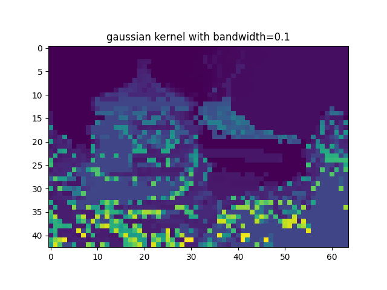
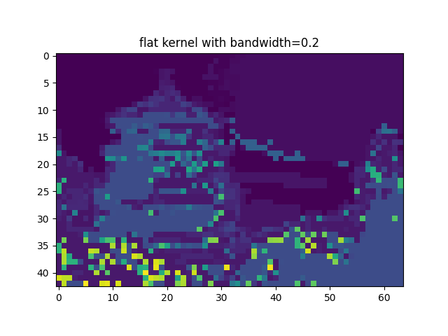
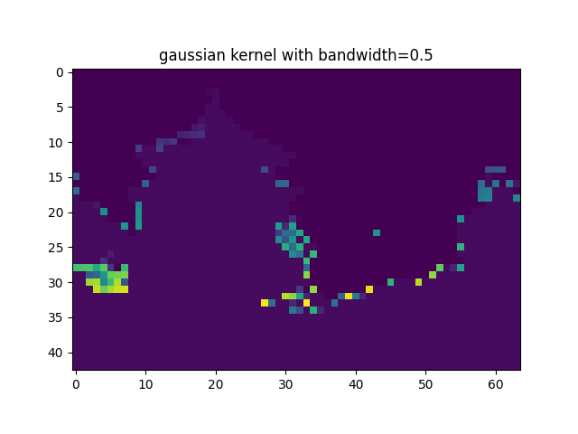
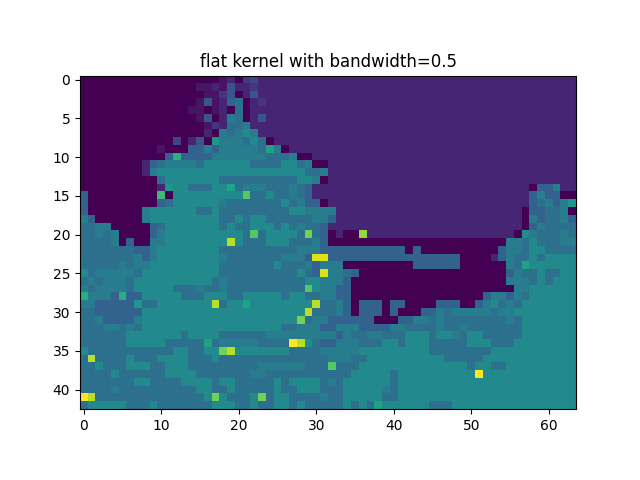
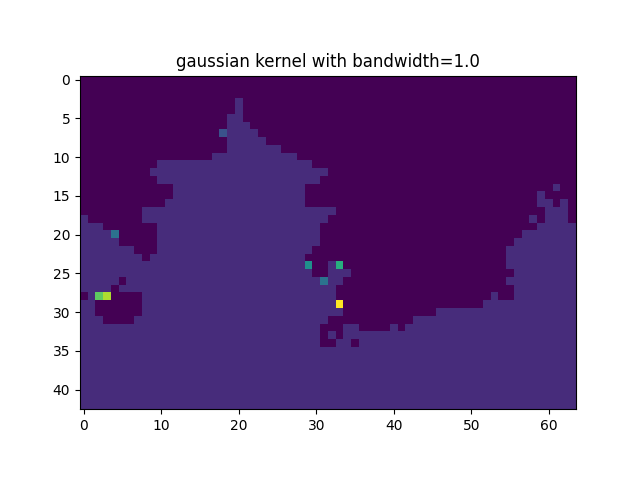
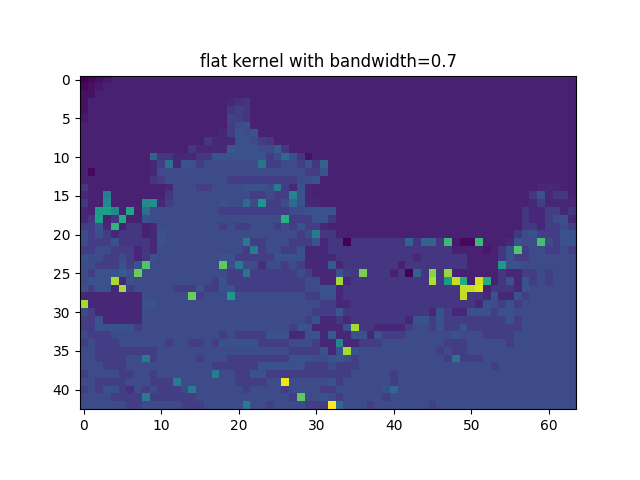
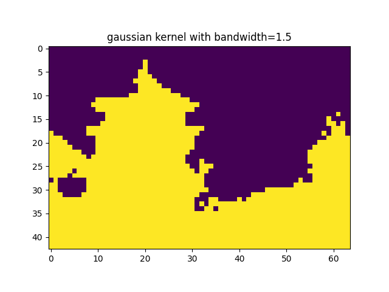
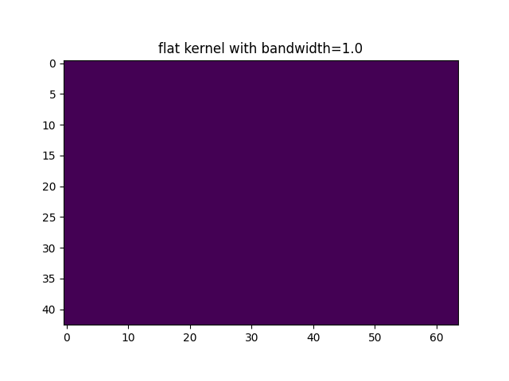

# Project for Data Mining 2023 Class

## Requirements

- Topic: Image instance segmentation using Mean-shift clustering
- Input: RGB image
- Output: Instance segmented image with highlighted segments

## Set up

1. Create a virtual environment
2. Install the required packages: 

```bash
pip install -r requirements.txt
```

## Run the project

First, change directory into the project folder:

```bash
cd project
```

The clustering algorithm can be run with the following command:

```bash
python segment.py [-h] [-i INPUT] [-v | --verbose | --no-verbose] [-o OUTPUT] [-k KERNEL] [-bd BANDWIDTH] [-t THRESHOLD]
```

To see the detailed description of the arguments, run:

```bash
> python segment.py --help

options:
  -h, --help                    show this help message and exit
  -i, --input                   Path for the input image, e.g: ./data/example.png
  -v, --verbose, --no-verbose   Enable verbose mode (default: True)
  -o, --output                  Path for output highlighted image
  -k, --kernel                  Kernel Function to use. Available options: flat, gaussian
  -bd, --bandwidth              Bandwidth for the kernel function
  -t, --threshold               Threshold for stopping the clustering
```

For example, to run the algorithm with:

- [test image](/project/data/china_resized.jpg), run:
- Flat kernel with bandwidth = 0.5:
- Output image: [output.jpg](/project/data/output.jpg)

```bash
python segment.py --input data/china_resized.jpg --output output_flat.jpg --kernel flat --bandwidth 0.5
```

## Project structure

The project is structured as below. The core entities in the project are:

- data classes:
  - DataVector: a vector of data points
  - Point: a data point, can be 1, 2 or 3 dimensional
- kernel classes: GaussianKernel/FlatKernel
- clustering algorithm: MeanShiftClustering

```
dm2023
├─ .gitignore
├─ README.md
├─ project
│  ├─ core
│  │  ├─ __init__.py
│  │  ├─ clustering
│  │  │  ├─ MeanShiftClustering.py
│  │  │  └─ __init__.py
│  │  ├─ dataobject
│  │  │  ├─ DataVector.py
│  │  │  ├─ Point.py
│  │  │  └─ __init__.py
│  │  ├─ kernel
│  │  │  ├─ Kernel.py
│  │  │  └─ __init__.py
│  │  └─ utils
│  │     └─ __init__.py
│  ├─ notebooks
│  │  ├─ .gitignore
│  │  └─ test.ipynb
│  ├─ segment.py
├─ pyproject.toml
└─ requirements.txt
```

## Performance

To run the performance test, run:

```bash
# grant permission to the bash script if needed
chmod +x experiment.sh
./experiment.sh data/china_resized.jpg
```

The experiments for different parameters are all run with default threshold = 0.01. The result is as below:

| Kernel   | Parameter | Clusters | Time |
| -------- | --------- | -------- | ---- |
| flat     | 0.2       | 105      | 133  |
| flat     | 0.5       | 20       | 88   |
| flat     | 0.7       | 45       | 106  |
| flat     | 1.0       | 1        | 107  |
| gaussian | 0.1       | 188      | 169  |
| gaussian | 0.5       | 67       | 266  |
| gaussian | 1.0       | 9        | 107  |
| gaussian | 1.5       | 2        | 83   |


| Gaussian Kernel | Flat Kernel |
|:---------------:|:-----------:|
|  |  |
|  |  |
|  |  |
|  |  |

- For flat kernel, as shown above, a smaller bandwidth can lead to overfitting and a higher number of clusters as the algorithm might fit to the noise in the data.

- For Gaussian kernel, the bandwidth, or parameter *sigma*, controls the spread of the Gaussian function. Smaller *sigma* leads to a narrower Gaussian, so each point's influence is more local and results in a larger number of smaller clusters and vice versa.
